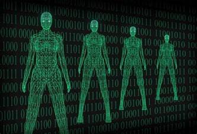
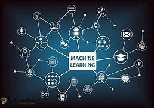
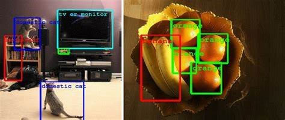
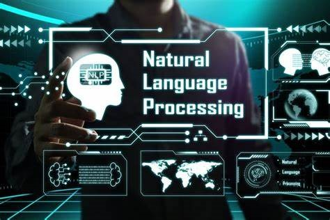
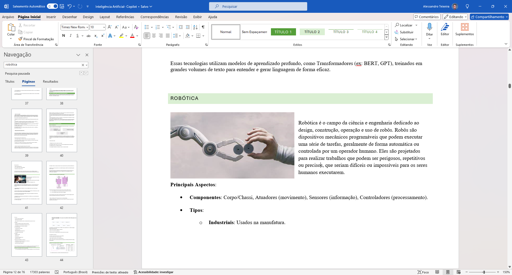
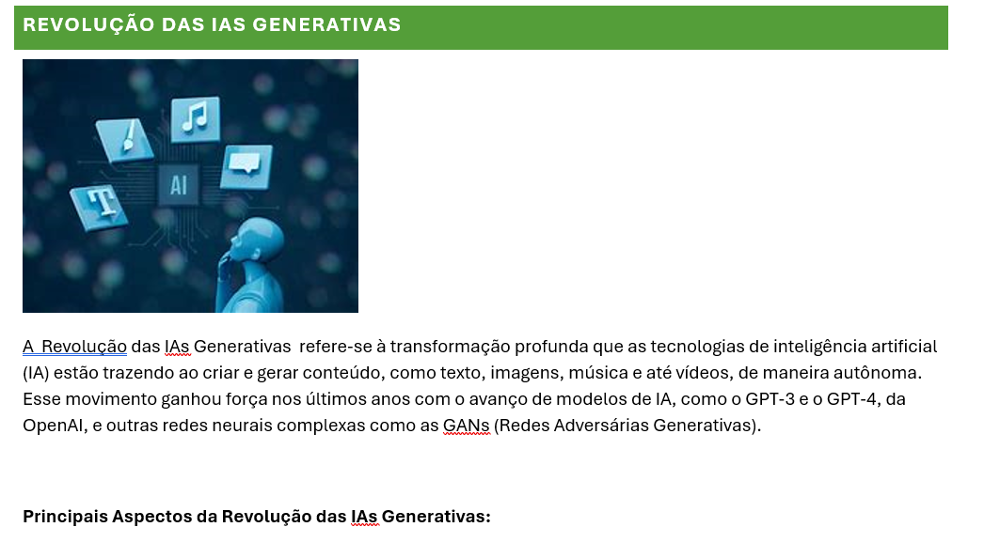

# Projeto de Inteligência Artificial - Copilot

Este repositório, criado por Alessandro contém o projeto **Inteligência Artificial - Copilot**, onde foi todo elaborado com base ao bootcamp da DIO + Microsoft copilot, elaborado e desenvolvido para explorar e estudar mais afundo os conceitos de IA e suas aplicações práticas no dia a dia. O foco principal é como a IA evoilui e evoluiiu em tão pouco tempo e hoje está sendo utilizado em diferentes contextos, para melhorar a vida dos humanos, assuntos, abordados no curso como; machine learning, visão computacional, processamento de linguagem natural, robótica, e os desafios éticos associados. Este arquivo .Md tambem foi elaborado com o copilot onde o mesmo me ajudou a fazer de maneira mais clara e compreensivel. Estarei deixando arquivo pdf onde, em todo o curso fiz anotações e resumos de cada tópico estudado.

## Sumário

1. [Introdução à Inteligência Artificial](#introdução-à-inteligência-artificial)
2. [Machine Learning](#machine-learning)
3. [Visão Computacional](#visão-computacional)
4. [Processamento de Linguagem Natural](#processamento-de-linguagem-natural)
5. [Robótica](#robótica)
6. [Privacidade e Segurança com IA](#privacidade-e-segurança-com-ia)
7. [Impacto da IA na Sociedade](#impacto-da-ia-na-sociedade)
8. [História da IA](#história-da-ia)
9. [Desafios Éticos](#desafios-éticos)
10. [Conclusão](#Conclusão)

## Introdução à Inteligência Artificial

A Inteligência Artificial (IA) é um campo da ciência da computação focado em criar sistemas que simulem a inteligência humana, como tomada de decisões e reconhecimento de padrões.

## Machine Learning

Machine Learning (ML) é um subcampo da IA que permite que máquinas aprendam a partir de dados, sem serem explicitamente programadas para realizar determinadas tarefas.

### Tipos de Machine Learning:

- **Aprendizado Supervisionado**
- **Aprendizado Não Supervisionado**
- **Aprendizado por Reforço**

## Visão Computacional

A Visão Computacional capacita máquinas a interpretar e fazer decisões a partir de dados visuais. Exemplos incluem reconhecimento facial e detecção de objetos.

## Processamento de Linguagem Natural

O Processamento de Linguagem Natural (PLN) envolve a interação entre computadores e linguagem humana, permitindo que máquinas compreendam e respondam a comandos em linguagem natural.

## Robótica

A robótica integra IA para desenvolver máquinas que possam executar tarefas complexas de forma autônoma, como robôs industriais ou assistentes pessoais.

## Privacidade e Segurança com IA

Com o avanço da IA, surgem desafios relacionados à privacidade e segurança dos dados. É essencial garantir o uso responsável dessas tecnologias.

## Impacto da IA na Sociedade

A IA está revolucionando diversos setores, desde a saúde até o transporte, mas também levanta questões éticas, como o impacto no mercado de trabalho.

## História da IA

A evolução da IA abrange desde os primeiros algoritmos de aprendizado de máquina até os atuais modelos de deep learning.

## Desafios Éticos

É crucial abordar questões como vieses algorítmicos e a transparência nas decisões feitas por IA.

## Conclusão

Este Bootcamp visa não apenas explorar as capacidades técnicas da IA, mas também uma forma de reflexão sobre suas desdobramentos éticos e sociais, em relação a evolução das Ias, garantindo que seu uso seja de melhor forma explora para nós beneficiar. em varios aspecto de nossas vidas.
Adquiri uma compreensão de varios aspectos fundamentasi de IA, e conheci ferramentas que com certeza estarão me auxiliando no meu aprendizado e tambem no meu dia a dia. Esse projeto nos da uma maior conhecimento de como o mundo da Ias está evoluindo rapidamente e como cada uma está sendo aplicada no mundo real, para afim de nos beneficiarmops da mesma.
Dentro todo o boot camp o que me mais chamou atenção foi como e aprendizado das IAs e conseguem "ver" e interpretar imagens e vídeos,e tambem como a IA impacta na sociedade, e tambem os desafio eticos encontrados. Por fim, este estudo me deu uma visão ampla e profunda da IA, suas aplicações práticas. Obrigado 😎❤️
